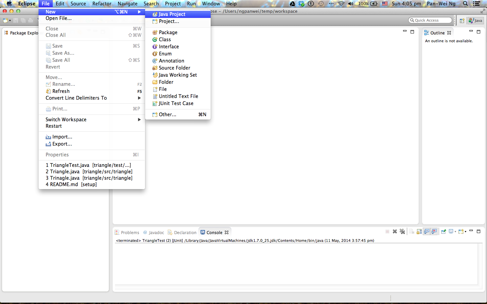
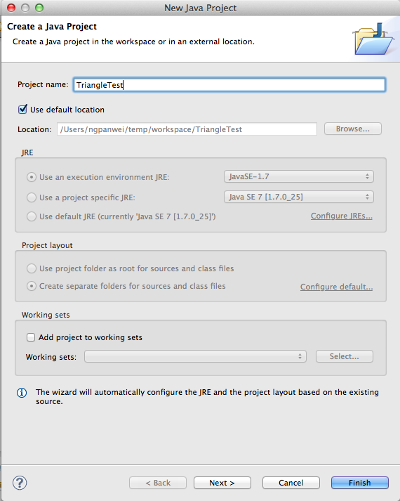
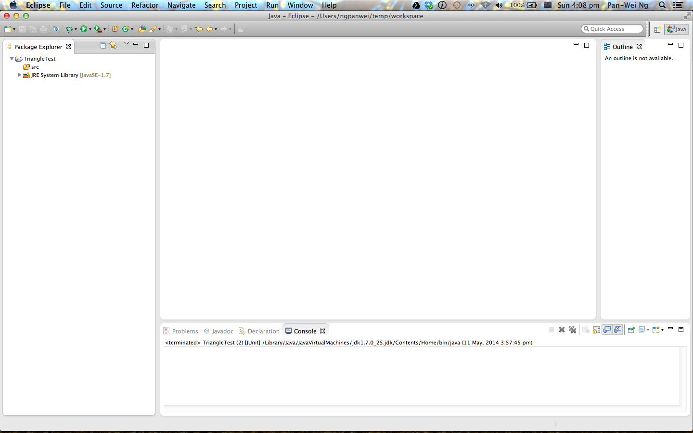
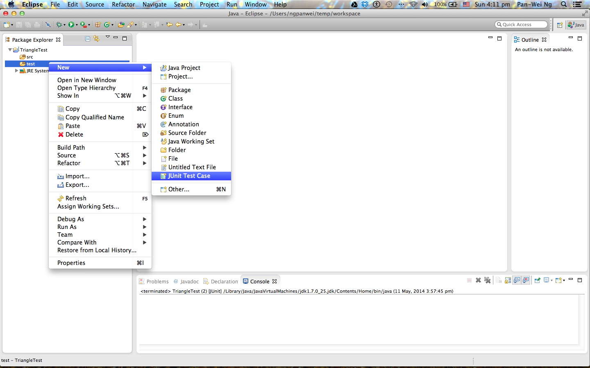
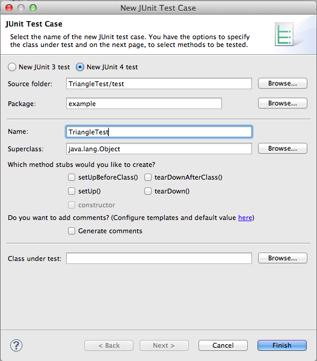
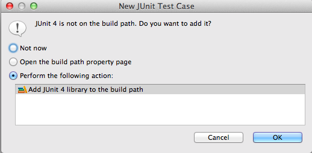
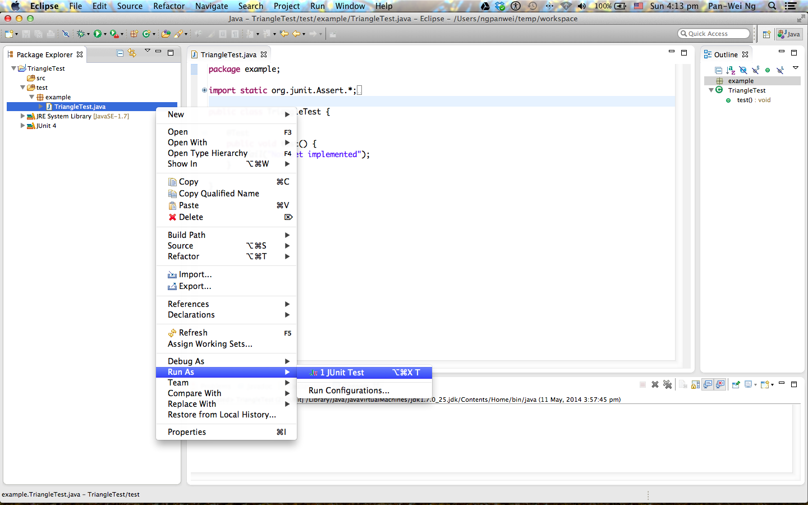
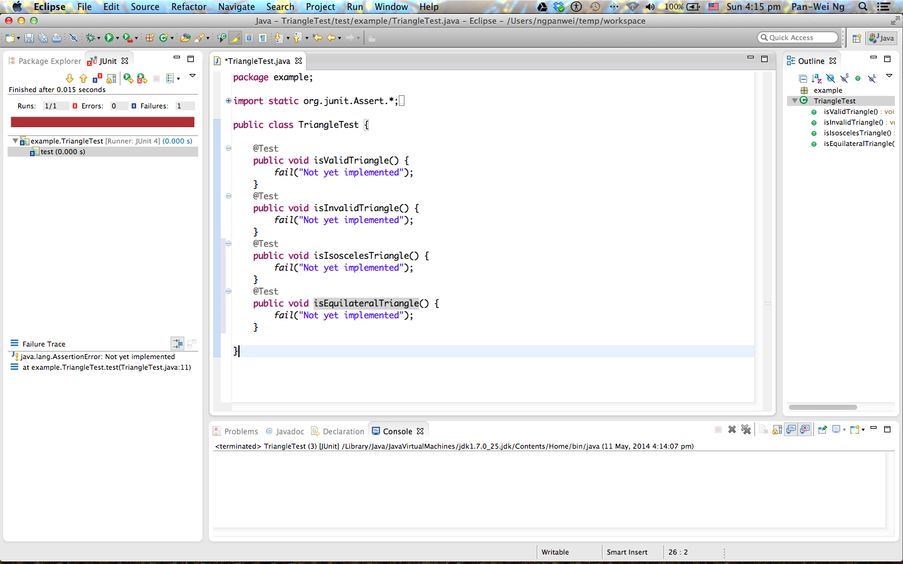
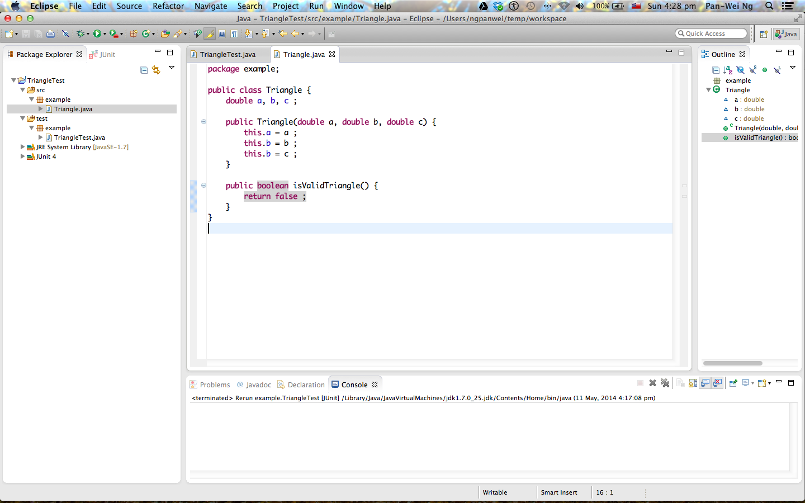
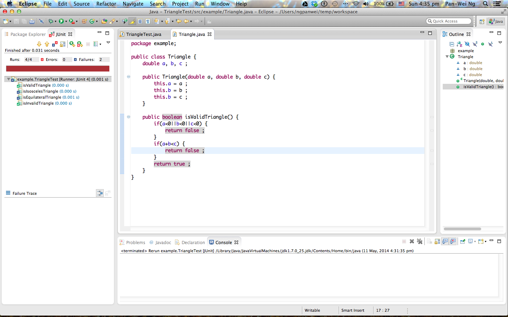

TDD jUnit Quick Introduction
============================

This is a quick tutorial to introduce to TDD using Eclipse and JUnit. We assume that you have Eclipse installed.

1. [Create a Java Project with src and test folder](#create-a-java-project-with-src-and-test-folder)
1. [Create Initial Test Code](#create-initial-test-code)
1. [Write Some Test Code](#write-some-test-code)
1. [Start to write target code to pass some tests](#start-to-write-target-code-to-pass-some-tests)
1. [Think of some failing examples and code to pass the tests](#think-of-some-failing-examples-and-code-to-pass-the-tests)

The idea of TDD is to close the loop between analysis, coding and testing through rapid cycles. Run tests often, fail often and fix quickly!

### Create a Java Project with src and test folder
First creat a Java project for this tutorial.
Select Menu --> File --> New --> Java Project

Enter "TriangleTest" as project name

Eclipse create an src folder for you to add your code

Create a source folder to contain test code.
Right click on project --> New --> Source Folder

Enter test folder name "test"

### Create Initial Test Code
Create a JUnit Test Case
Right click on "test" folder --> New --> JUnit Test Case

Enter Package "example" and Name "TriangleTest"

Import Junit4 (use defaults and choose OK)

Eclipse JUnit creates skeleton code for TriangleTest
![TDD-11-Initial-Test-Result.png]/(images/TDD-11-Initial-Test-Result.png)

Run the empty test case
Right click on TriangleTest test case --> Run As --> JUnit Test

View test results

### Write Some Test Code
Think of some test cases an express as method names

Run the test again 
![TDD-13-Run-TestCases-Again.png]/(images/TDD-13-Run-TestCases-Again.png)

And view the results.
![TDD-14-Test-Results.png]/(images/TDD-14-Test-Results.png)
The idea is tp run tests often and fail often and fix.

Write some test code and think of the class API
![TDD-15-Write-Some-TestCode-And-ThinkOf-API.png]/(images/TDD-15-Write-Some-TestCode-And-ThinkOf-API.png)

### Start to write target code to pass some tests
First create the class
Select src folder and right click --> New --> Class
![TDD-16-Create-Code.png]/(images/TDD-16-Create-Code.png)

Enter Package "example" and Name "Triangle"
![TDD-17-Create-example-Triangle.png]/(images/TDD-17-Create-example-Triangle.png)

Eclipse IDE creates an empty Triangle class
![TDD-18-Initial-Triangle.png]/(images/TDD-18-Initial-Triangle.png)

Write some code to make sure the system compiles

Now run the tests again and view the results
![TDD-20-Run-Tests-Again.png]/(images/TDD-20-Run-Tests-Again.png)

Add some code to pass some tests
![TDD-21-Two-Test-Cases-Passed.png]/(images/TDD-21-Two-Test-Cases-Passed.png)

Update the test document (comments in the assert statements)
![TDD-22-Update-Test-Documentation.png]/(images/TDD-22-Update-Test-Documentation.png)

### Think of some failing examples and code to pass the tests
Think of some failing cases: for example sum of two sides less than third side
![TDD-23-Thnink-Of-A-Failing-Condition.png]/(images/TDD-23-Thnink-Of-A-Failing-Condition.png)

Now write more code to pass the test

Run tests again and see the results
![TDD-25-Run-Tests-Again.png]/(images/TDD-25-Run-Tests-Again.png)

